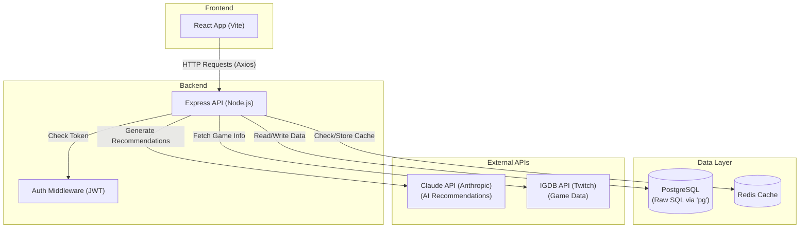

# SavePoint - Interview Defense Document

## 1. Architecture Diagram



## 2. Crux Code Extraction

### Stage 1: React Frontend (AI Recommendation Form)
```javascript
// why: Sends the user's mood to the backend and waits for AI suggestions
const handleSubmit = async (e) => {
    e.preventDefault();
    setLoading(true);

    try {
        // why: Calls our own Express server, passing the text the user typed
        const res = await axios.post('http://localhost:5005/api/ai/recommend', { mood });
        // why: Updates the screen with the AI's response
        setRecommendations(res.data);
    } catch (err) {
        setError('Failed to get recommendations.');
    } finally {
        setLoading(false);
    }
};
```
*If asked why:* I used standard React state and Axios because it's lightweight and easy to understand for simple form submissions without needing complex state management like Redux.

### Stage 2: Express API & Core Logic (AI Route)
```javascript
// why: Protects the route and processes the AI recommendation request
router.post('/recommend', auth, async (req, res) => {
    const { mood } = req.body;

    // why: Fetches what the user has already played so the AI doesn't recommend them
    const libraryResult = await db.query(`
        SELECT g.title FROM user_games ug
        JOIN games g ON ug.game_id = g.id
        WHERE ug.user_id = $1
    `, [req.user.id]);

    const playedGamesContext = libraryResult.rows.map(row => row.title).join(', ');

    // why: Builds the prompt telling the AI exactly what to do and what format to return
    const prompt = `You are an expert game recommender. User mood: "${mood}".
    They already played: ${playedGamesContext}. 
    Recommend 5 games in strict JSON format.`;

    // why: Calls Claude to get the actual recommendations
    const response = await axios.post('https://api.anthropic.com/v1/messages', {
        model: 'claude-3-haiku-20240307',
        messages: [{ role: 'user', content: prompt }]
    }, {
        headers: { 'x-api-key': process.env.CLAUDE_API_KEY }
    });

    // why: Extracts and parses the JSON from Claude's text response
    const parsedData = JSON.parse(response.data.content[0].text);
    res.json(parsedData);
});
```
*If asked why:* I gathered the user's library context *before* calling the AI so the AI can give personalized recommendations instead of generic ones they've already played. I enforce a strict JSON output so the frontend can easily map over the results.

### Stage 3: Database Layer (PostgreSQL Query)
```javascript
// why: Sets up the connection to the Postgres database
const { Pool } = require('pg');
const pool = new Pool({ connectionString: process.env.DATABASE_URL });

// why: Exporting a wrapper around pool.query so other files can just call db.query()
module.exports = {
    query: (text, params) => pool.query(text, params),
};
```
*If asked why:* I chose the `pg` package and raw SQL instead of an ORM like Sequelize because it gives me full control over the queries, and for a small project, raw SQL is often faster to write and easier to debug.

---

## 3. Interview Defense Document

### 30-Second Pitch
"This is SavePoint, a game tracking and discovery app built with the PERN stack. It lets users search for games, build a personal library, and get AI-powered recommendations based on their mood and what they've already played. I chose the PERN stack because it's robust and flexible, and my standout technical decision was integrating the Claude AI API alongside IGDB game data, while using Redis caching to keep the external API calls fast and within rate limits."

### Architecture Decisions Table

| Stage | What I Chose | Realistic Alternative | Why I Chose It (Simply) |
|---|---|---|---|
| Database | **Raw SQL (pg)** | Prisma or Sequelize (ORMs) | I wanted to practice writing real SQL queries. ORMs can hide what's actually happening, and for these simple JOINs, raw SQL was just more straightforward. |
| API Layer | **Express.js** | NestJS or Fastify | Express is the industry standard for Node. It's unopinionated, meaning I could structure the routes exactly how I wanted without fighting a framework. |
| External APIs | **IGDB + Redis** | RAWG API (No Cache) | IGDB has great data but requires Twitch OAuth. I added Redis caching so I'm not constantly hitting their API for the same searches, making the app much faster. |
| Frontend | **React (Vite) + Context** | Next.js + Redux | Next.js was overkill since I didn't need server-side rendering for SEO yet. Context API handles the simple user login state perfectly without the heavy setup of Redux. |

### End-to-End Flow (Expanded - The Memory Section)
*Example: Asking the AI for a game recommendation.*

1. **User types a mood in React and clicks submit.**
   - *In one sentence:* The frontend takes the text and sends an HTTP POST request to the backend.
   - *Why it exists:* We need a way to collect what the user wants and send it to the server.
   - *Analogy:* This is like handing your custom order slip to the cashier.

2. **Express Auth Middleware checks the token.**
   - *In one sentence:* The server looks at the request headers to make sure the user is actually logged in.
   - *Why it exists:* If we didn't do this, anyone could spam the AI endpoint and use up our API credits.

3. **Express fetches the user's game library from Postgres.**
   - *In one sentence:* The backend runs a SQL query to get a list of games the user has already played.
   - *Why it exists:* So we can tell the AI *not* to recommend these games. It makes the suggestions actually useful.

4. **Express builds a prompt and calls the Claude API.**
   - *In one sentence:* The server combines the user's mood and their played games into one big text instruction, then sends it to Anthropic.
   - *Why it exists:* This is the core feature. Without this step, we wouldn't have AI recommendations.

5. **Express parses the response and sends it back to React.**
   - *In one sentence:* The server takes the text the AI spit out, turns it into a Javascript object (JSON), and sends it to the frontend.
   - *Why it exists:* The frontend needs structured data (like a list) to draw the screen properly, not just a block of text.

6. **React updates the screen.**
   - *In one sentence:* The frontend takes the JSON array and loops through it to draw the game cards on the screen.
   - *Why it exists:* To actually show the user their results.

### Deep-Dive on the Most Unique Part: The AI Matchmaker
**How it works:** When a user asks for a recommendation, the backend first grabs their entire played game library from the database. It then constructs a large text prompt that says: "The user wants this mood. Here is what they've already played. Recommend 5 new games and return it as strict JSON." It sends this to the Claude API. When Claude replies with the JSON string, the backend parses it into an object and sends it to the frontend to display.
**What feeds into it:** The user's typed mood, and their personal game library from the Postgres database.
**What could go wrong:** Claude might ignore the instruction to return *only* JSON and include conversational text (like "Here are your games:"). If this happens, `JSON.parse()` will crash the server. (The code handles this with a regex backup plan, but it's a common AI flaw).
**One-breath version:** "It fetches the user's played games from Postgres, bundles that with their requested mood into a prompt for Claude, and asks Claude to return exactly 5 new recommendations formatted as JSON."

### Per-Stage Likely Questions

**Database:**
- *Q: Why use Postgres instead of MongoDB?*
- A: Because the data is highly relational. A user has games, games have reviews, users have lists. SQL JOINs make it much easier to connect all this together than a NoSQL document database.

**Backend/API:**
- *Q: Why use Redis for caching?*
- A: To speed up the app and save API calls. When someone searches for "Zelda", I save the IGDB results in Redis. The next person who searches "Zelda" gets the results instantly from Redis instead of waiting for the external API.

**Frontend:**
- *Q: How are you managing state?*
- A: I'm using local component state (`useState`) for things like forms and search results, and the React Context API just for the user's login session so it's available everywhere.

**Auth:**
- *Q: How does your authentication work?*
- A: When a user logs in, the server checks their hashed password using bcrypt. If it matches, it creates a JWT (JSON Web Token) and sends it back. The frontend saves this token and attaches it to future requests to prove who they are.

### Weaknesses & Failure Cases
1. **The AI JSON parsing can break:** If Claude decides to completely ignore the JSON instruction and writes a paragraph instead, the parsing will fail and the user gets an error.
2. **IGDB Token Expiry:** The app fetches a Twitch OAuth token for game data. If Twitch's auth servers go down, the entire search and discovery part of the app stops working.
3. **No Frontend Pagination:** If a user adds 1000 games to their library, the React app will try to render all 1000 at once, which could lag the browser.

### What I'd Improve With More Time
1. Add pagination or infinite scrolling to the game lists so it doesn't load everything at once (Pagination).
2. Move the external API calls into a background worker queue so the user isn't stuck waiting if the IGDB or Claude APIs are being slow (Message Queue / Background Jobs).
3. Use a proper ORM or query builder instead of raw SQL strings to prevent typos and make the database code easier to maintain (Query Builder).

### Anticipated Q&A Table

| Question | Simple Answer |
|---|---|
| "Why not use Redux for state?" | It was overkill. Context API handles the user login perfectly, and local state handles the rest. |
| "What happens if the IGDB API goes down?" | The app would fail to load search results or the landing page. In the future, I'd want to add fallback data or better error screens. |
| "Why store JWTs in local storage instead of cookies?" | Local storage was simpler to set up quickly for a portfolio project, though HttpOnly cookies are safer against cross-site scripting (XSS) attacks. |
| "How do you handle password security?" | I use `bcrypt` to salt and hash the passwords before saving them to Postgres, so the plain text passwords are never stored. |
| "What is the biggest bottleneck in your app?" | Waiting for the Claude API to generate recommendations. AI generation is inherently slow. |
| "Why not use an ORM like Prisma?" | I wanted to ensure I really understood SQL. Writing raw queries forced me to understand exactly how the tables connect. |

### "IF I FORGET EVERYTHING ELSE" - One-Page Memory Summary
- **The Pitch:** A PERN stack game tracker that uses IGDB for data and Claude AI for personalized recommendations.
- **The Big Whys:**
  - *Postgres:* Because the data is relational (users -> games).
  - *Express:* Simple, standard, unopinionated.
  - *React Context:* Handled login state without the bloat of Redux.
  - *Redis:* Cached external API calls to make the app way faster.
  - *Raw SQL:* Forced me to learn real database queries instead of relying on magic ORMs.
- **The One Thing They'll Ask About:** The AI Matchmaker. Remember how it works: it pulls their played games from the DB *first*, bundles it with their mood, sends it to Claude asking for strict JSON, and parses the response for React to display.
